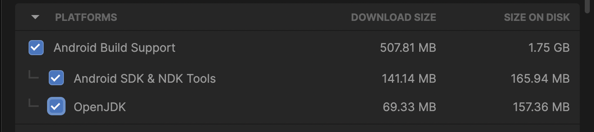
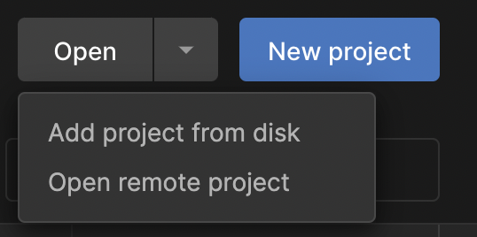
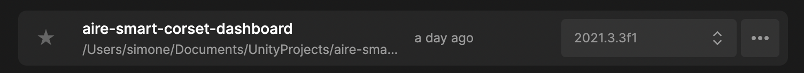
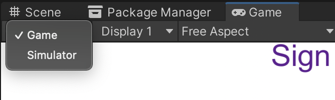
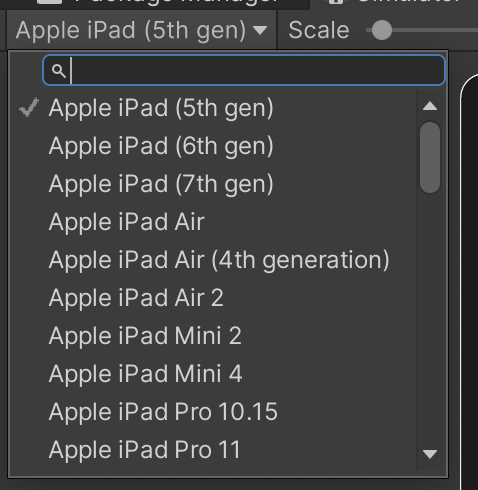
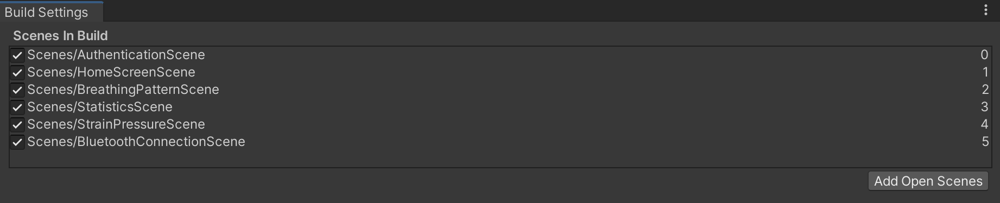

> [!CAUTION]
> This repository is archived and out of commission. The contents of this repository have been merged with the main repository: [health_monitoring_platform_for_orthopaedic_devices.git](https://github.com/ai-robotics-estonia/health_monitoring_platform_for_orthopaedic_devices.git)

**SMART BRACE UI PROTOTYPE DOCUMENTATION**

The aire-smart-corset-dashboard is a user interface prototype aimed at real-time monitoring and guidance of the patients using a smart scoliosis brace. The final purpose of this app is to support both patients and medical personnel during the scoliosis treatment process by providing both real-time data visualization and brace usage statistics.

The interface is in a demo state and constitutes only an interactable mock-up of the future final application.

**Software requirements for testing**

- Unity Hub.
- Unity, version 2021.3.3 f1.
- Required Unity modules for Android build.

**INSTALLATION**

Before cloning or downloading the repo make sure Unity is installed on your PC. To do so first install Unity Hub available at this [link](https://unity3d.com/get-unity/download). You might need to register first, and activate a free individual, Personal or Student,
license on the Unity website. More info about Unity licenses and usage are available [here](https://store.unity.com/#plans-individual).

After installing Unity Hub, locate the required Unity version (2021.3.3f1.) in the *Install* tab on the left. Alternatively, you can access it at this [page](https://unity3d.com/get-unity/download/archive) and press on the *Unity Hub* button to start the installation.

Before initiating the installation procedure, make sure you flag all the options related to the Android modules installation and include Android Built support with Android SDK & NDK Tools and OpenJDK.

After installation, locate the project you cloned or downloaded on your PC from the Unity Hub *Open, Add project* *from disk* option.

After locating the repo folder on your PC the project will appear in the available projects in Unity Hub. Click on the project name to open it. This might take a few minutes.

**PROJECT SCENES**

Unity game engine scenes are assets containing all or parts of the components and elements necessary for a specific application to run. These include interface components, 3D objects, scripts, audio and video sources, input sources, physics components etc. For more basics on the Unity features and UI please refer to the info provided [here](https://unity.com/learn/get-started).

There are a few scenes involved in the current application demo. The first set is constituted by the mobile user interface dashboard pages, including the graphical contents and navigation buttons.

- *AuthenticationScene*
- *BluetoothConnectionScene*
- *BreathingPatternScene*
- *HomeScreenScene*
- *StatisticsScene*
- *StrainPressureScene*

The second includes a 3D 'Digital Twin' visualization of the user avatar and corset, with some preliminary interactions and visualization toggles.

- *Smart Corset DT 0.1*

It is possible to open and access the scenes by navigating the project (*Project* tab in Unity) and open the *Scenes* folder.

**RUNNING ON EDITOR SIMULATOR**

To be able to visualize the editor application preview of the Mobile UI:

-   Open *AuthenticationScene*
-   Access the *Game* tab and switch to *Simulator* option

-   Select the device you want to emulate in the drop-down menu

-   Press the play button in the top center of the Unity UI
-   Interact with the UI by using the mouse to click

Follow the same steps to access the 3D corset visualization by opening the dedicated scene *Smart Corset DT 0.1.*

**BUILD**

Alternatively, it is possible to build the project in two different apps, install and test them on any android device. To be able to do this:

-   Access the *Build Settings* menu under *File*

-   Open each of the related scenes (mentioned above) and add them to the build by clicking on the *Add Open Scenes* button. Arrange the scenes in the correct order in the menu by clicking and dragging them. Make sure the necessary scenes are flagged so that they can be included in the build.

-   Switch platform to Android build by clicking on the *Android* logo and pressing the *Switch Platform* on the bottom right of the menu.

-   Press *Build* button and wait until the .apk file is saved in the selected location on your PC.

-   Transfer and install the .apk file on your mobile device. You might need to grant permission to install applications from unknown sources on your mobile.

-   Open and test the application

Follow the same steps to build the 3D corset visualization app but include the *Smart Corset DT 0.1* scene only when setting up the build.
